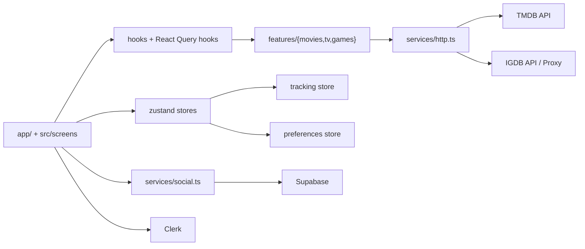

# Flicksy

<p align="center">
  <b>Track movies, TV shows, and games in one place.</b><br/>
  Discovery + personal library + social features, built with Expo/React Native.
</p>

<p align="center">
  
  
  
  
  
  
  
  
</p>

## Why Flicksy
- **Unified tracking** for movies, TV and games
- **Global discovery and search** across media types
- **Social layer** with friends, shared ratings, and compatibility
- **Library depth**: statuses, ratings, date ranges, goals, achievements
- **Web + mobile UX** with responsive layouts and floating details on web

## Feature Highlights

### Discovery
- Popular/sorted feeds for each media type
- Dedicated "browse all" sections
- Cross-media search

### Personal Library
- Status tracking by media type:
  - Movie: `planned`, `completed`
  - TV: `planned`, `watching`, `completed`
  - Game: `planned`, `playing`, `completed`
- Ratings (0-10, 0.5 steps)
- Date capture:
  - Movie: single watch date
  - TV/Game: start + end dates
  - Approximate date flags
- List and gallery views

### Social & Profile
- Friend requests and friend libraries
- Friend ratings in detail screens
- Compatibility scoring
- Avatar/profile sync
- Goals and achievements

## API Integrations

| API / Service | Purpose in Flicksy | Auth / Credentials | Where it's used |
|---|---|---|---|
| **TMDB** | Movies/TV discovery, search, details, images | `EXPO_PUBLIC_TMDB_API_KEY` | `src/features/movies/*`, `src/features/tv/*`, `src/services/http.ts` |
| **IGDB** | Games discovery, search, details | `EXPO_PUBLIC_IGDB_CLIENT_ID`, `EXPO_PUBLIC_IGDB_ACCESS_TOKEN` | `src/features/games/*`, `src/services/http.ts` |
| **IGDB Proxy (Web)** | Secure IGDB calls from web | Server env in API function/proxy | `api/igdb/[...path].ts`, `scripts/igdb-proxy.js` |
| **Clerk** | Authentication/session | `EXPO_PUBLIC_CLERK_PUBLISHABLE_KEY` | `app/_layout.tsx`, `src/services/clerk.ts` |
| **Supabase** | Social data, relationships, cloud persistence | `EXPO_PUBLIC_SUPABASE_URL`, `EXPO_PUBLIC_SUPABASE_ANON_KEY` | `src/services/social.ts`, `src/services/supabase.ts` |

### API Notes
- **TMDB** is used directly from client code.
- **IGDB**:
  - Native runtime: direct IGDB calls with credentials.
  - Web runtime: routed through proxy (`/api/igdb`) to avoid exposing IGDB credentials in browser requests.

## Architecture at a Glance



## Project Structure

```text
app/
  (tabs)/
  movie/[id].tsx
  tv/[id].tsx
  game/[id].tsx
  browse/[type].tsx
  friends.tsx
  friend/[id].tsx
  achievements.tsx

src/
  components/
  features/
    movies/
    tv/
    games/
    achievements/
  hooks/
  providers/
  screens/
  services/
  store/
  types/
  utils/

api/
  igdb/[...path].ts

scripts/
  igdb-proxy.js
```

## Requirements
- Node.js 18+
- npm 9+
- Xcode (for iOS simulator)
- Android Studio (for Android emulator)

## Environment Variables

Create `.env.local` at repository root.

### Required
```bash
# TMDB
EXPO_PUBLIC_TMDB_API_KEY=

# IGDB
EXPO_PUBLIC_IGDB_CLIENT_ID=
EXPO_PUBLIC_IGDB_ACCESS_TOKEN=

# Clerk
EXPO_PUBLIC_CLERK_PUBLISHABLE_KEY=

# Supabase
EXPO_PUBLIC_SUPABASE_URL=
EXPO_PUBLIC_SUPABASE_ANON_KEY=
# Optional alias supported:
# EXPO_PUBLIC_SUPABASE_PUBLISHABLE_KEY=
```

### Optional
```bash
# Deep linking
EXPO_PUBLIC_APP_URL=flicksy://

# Web IGDB proxy (web runtime)
EXPO_PUBLIC_IGDB_PROXY_URL=/api/igdb
EXPO_PUBLIC_IGDB_LOCAL_PROXY_URL=http://127.0.0.1:8787/api/igdb

# IGDB debug logs
EXPO_PUBLIC_DEBUG_IGDB=false
```

## Quick Start

```bash
npm install
cp .env.example .env.local
# fill values in .env.local
```

Run:
```bash
npm start
```

Platform shortcuts:
```bash
npm run ios
npm run android
npm run web
```

## Scripts

```bash
npm start            # Expo dev server
npm run ios          # iOS
npm run android      # Android
npm run web          # Web
npm run export:web   # Export web to dist/
npm run proxy:igdb   # Local IGDB proxy
npm run lint         # Lint
npm run type-check   # TS check
npm test             # Unit tests
npm run test:watch
npm run test:coverage
npm run format
```

## Routing

### Tabs
- `/(tabs)/index` -> Home
- `/(tabs)/explore` -> Search
- `/(tabs)/tracked` -> Library
- `/(tabs)/profile` -> Profile

### Detail/Modal routes
- `/movie/[id]`
- `/tv/[id]`
- `/game/[id]`
- `/browse/[type]`
- `/friends`
- `/friend/[id]`
- `/achievements`

## Data & State

### Stores
- `src/store/tracking.ts`
  - tracked items
  - local persistence
  - remote bootstrap/sync
- `src/store/preferences.ts`
  - theme and UX defaults
  - goals and achievement flags

### Query/Data
- Feature repositories:
  - `src/features/movies/*`
  - `src/features/tv/*`
  - `src/features/games/*`
- Shared HTTP clients:
  - `src/services/http.ts`

### Social
- `src/services/social.ts`
  - friend graph
  - requests
  - compatibility
  - friend library/rating surfaces

## IGDB Proxy Setup (Web)

### Local proxy
```bash
npm run proxy:igdb
```
Serves:
`http://127.0.0.1:8787/api/igdb`

### Serverless proxy
- API route: `api/igdb/[...path].ts`
- Vercel config: `vercel.json`

## Web Build & Deploy

Build static output:
```bash
npm run export:web
```

Generated output:
- `dist/`

`vercel.json` is already set to:
- build with `npm run export:web`
- serve from `dist`
- run API functions under `api/**`

## Testing
```bash
npm test
npm run test:watch
npm run test:coverage
```

## Troubleshooting

### Empty feeds or fetch failures
- Verify all required env variables.
- Check TMDB and IGDB credentials.
- On web, confirm IGDB proxy path is reachable.

### Auth not loading
- Verify `EXPO_PUBLIC_CLERK_PUBLISHABLE_KEY`.
- Confirm Clerk app settings for your domains/deep links.

### Social features failing
- Verify Supabase URL/key.
- Confirm DB schema + RLS/policies are correctly configured.

### IGDB web requests failing locally
- Start local proxy: `npm run proxy:igdb`
- Ensure `EXPO_PUBLIC_IGDB_LOCAL_PROXY_URL` is correct.

## Roadmap
- Broader integration/UI test coverage
- Better onboarding/empty-state guidance
- Continued recommendations and social UX improvements
- Ongoing performance tuning for large libraries

---

Contributions are welcome. Keep PRs focused, update docs when behavior changes, and maintain parity across movie/TV/game UX when implementing new flows.
