# Memoria TFG - Flicksy

> Documento tecnico-academico generado a partir del analisis completo del repositorio local `flicksy-mobile`.

---

## 0. Indice

- [1. Portada](#1-portada)
- [2. Resumen (ES) y Abstract (EN)](#2-resumen-es-y-abstract-en)
- [3. Introduccion](#3-introduccion)
- [4. Estado del arte y contexto](#4-estado-del-arte-y-contexto)
- [5. Requisitos](#5-requisitos)
- [6. Analisis y diseno](#6-analisis-y-diseno)
- [7. Implementacion](#7-implementacion)
- [8. Experiencia de usuario y diseno visual](#8-experiencia-de-usuario-y-diseno-visual)
- [9. Pruebas y calidad](#9-pruebas-y-calidad)
- [10. Despliegue y operacion](#10-despliegue-y-operacion)
- [11. Resultados y evaluacion](#11-resultados-y-evaluacion)
- [12. Conclusiones](#12-conclusiones)
- [13. Trabajo futuro](#13-trabajo-futuro)
- [14. Bibliografia](#14-bibliografia)
- [15. Anexos](#15-anexos)

---

## 1. Portada

**Titulo del TFG**: <<DISENO E IMPLEMENTACION DE FLICKSY: PLATAFORMA MULTIMEDIA SOCIAL PARA PELICULAS, SERIES Y VIDEOJUEGOS>>  
**Proyecto**: `Flicksy` (identificado en `app.json` y `README.md`)  
**Tipo de proyecto**: <<APP MOVIL MULTIPLATAFORMA CON SOPORTE WEB (FRONTEND CLIENT + BaaS)>>  
**Autor/a**: <<TU_NOMBRE>>  
**Tutor/a**: <<TUTOR>>  
**Grado**: <<GRADO>>  
**Universidad**: <<UNIVERSIDAD>>  
**Curso academico**: <<2025-2026>>  
**Fecha**: <<FECHA>>

---

## 2. Resumen (ES) y Abstract (EN)

### 2.1 Resumen (ES)

Este Trabajo Fin de Grado presenta el analisis, diseno e implementacion de **Flicksy**, una aplicacion orientada al seguimiento personal y social de peliculas, series y videojuegos. El proyecto adopta una arquitectura modular por features (dominio, datos y presentacion), combina autenticacion externa con persistencia remota y almacenamiento local, e integra APIs de terceros para catalogo multimedia y datos enriquecidos. 

La solucion se desarrolla sobre Expo/React Native con soporte web mediante Expo Router, React Query para sincronizacion y cache, Zustand para estado global y Supabase como backend de datos y capa social. Para autenticacion se utiliza Clerk, con sincronizacion de perfil a Supabase. Se incluyen flujos de descubrimiento, busqueda global, biblioteca personal, perfil analitico, objetivos, logros y funcionalidades sociales (amistades, solicitudes, compatibilidad y valoraciones compartidas).

El analisis del repositorio evidencia una base funcional avanzada, con UI cuidada y logica de negocio extensa, pero tambien identifica carencias relevantes para un entorno productivo-academico: ausencia de migraciones/versionado de esquema en el repositorio, testing incompleto o desalineado, errores actuales de tipado estricto y ausencia de CI/CD formal. El documento propone un plan de mejora priorizado para robustecer calidad, seguridad, mantenibilidad y trazabilidad operativa.

### 2.2 Abstract (EN)

This dissertation presents the analysis, design, and implementation of **Flicksy**, a social multimedia tracking application for movies, TV shows, and video games. The project follows a feature-based modular architecture (domain, data, presentation), combining external authentication, remote persistence, and local storage, while integrating third-party APIs for rich catalog data.

The solution is built on Expo/React Native with web support through Expo Router, React Query for caching/synchronization, Zustand for global state, and Supabase as backend and social layer. Authentication is handled by Clerk with profile synchronization into Supabase. Main flows include discovery, global search, personal library, analytics profile, goals, achievements, and social capabilities (friend requests, compatibility metrics, and shared ratings).

Repository inspection shows a strong functional foundation and a polished user experience, but also highlights key engineering gaps: missing schema migrations in source control, incomplete/outdated test coverage, strict TypeScript errors in the current branch, and no formal CI/CD pipeline. A prioritized roadmap is provided to improve reliability, security, maintainability, and operational readiness.

### 2.3 Palabras clave

`Expo` · `React Native` · `Expo Router` · `TypeScript` · `React Query` · `Zustand` · `Supabase` · `Clerk` · `TMDb` · `IGDB` · `Aplicacion social`

---

## 3. Introduccion

### 3.1 Motivacion academica y de producto

Flicksy se plantea para resolver una friccion habitual en usuarios de entretenimiento digital: la vida multimedia real es transversal (peliculas, series y videojuegos), pero las herramientas de seguimiento suelen estar fragmentadas por dominio.

Esto genera tres costes de uso:
1. Coste de contexto: cambiar de app segun el tipo de contenido.
2. Coste de memoria: historiales, ratings y fechas repartidos en silos.
3. Coste social: amistades y recomendaciones desconectadas del historial completo.

En el repositorio, la motivacion se materializa en una arquitectura y UX unificadas:
- Tres dominios funcionales activos (`src/features/movies`, `src/features/tv`, `src/features/games`).
- Biblioteca personal comun (`src/store/tracking.ts`, `src/screens/TrackedScreen.tsx`).
- Capa social integrada en la experiencia principal (`src/services/social.ts`, `src/screens/ProfileScreen.tsx`, `src/screens/FriendsScreen.tsx`).
- Mecanismos de adherencia (objetivos/logros) (`src/features/achievements/catalog.ts`, `src/screens/AchievementsScreen.tsx`).

### 3.2 Problema a resolver

El problema principal no es falta de oferta de contenido, sino falta de continuidad operativa para el usuario:

1. **Fragmentacion funcional**  
   El seguimiento de cine/series y juegos suele ocurrir en sistemas diferentes.
2. **Descubrimiento poco contextualizado**  
   Las recomendaciones no siempre consideran el historial global del usuario entre dominios.
3. **Social no accionable**  
   Ver actividad de amistades sin poder compararla con la propia biblioteca reduce valor practico.
4. **Tracking insuficientemente granular**  
   Sin estados/fechas detalladas, el historial pierde utilidad analitica.

Evidencia de implementacion actual:
- Estados por tipo de media y metadatos de progreso (`src/types/index.ts`, `src/screens/TrackedScreen.tsx`).
- Fechas exactas y aproximadas (`src/components/common/CalendarInput.tsx`, `src/types/index.ts`).
- Compatibilidad y actividad de amistades (`src/services/social.ts`, `src/screens/HomeScreen.tsx`, `src/screens/FriendsScreen.tsx`).
- Objetivos periodicos y logros (`src/screens/ProfileScreen.tsx`, `src/features/achievements/catalog.ts`).

### 3.3 Objetivos

#### Objetivo general

Disenar e implementar una aplicacion multiplataforma que unifique seguimiento personal y social de peliculas, series y videojuegos, con catalogo externo, persistencia local-remota y trazabilidad de progreso.

#### Objetivos especificos

1. Integrar catalogos externos de TMDb e IGDB con un contrato de datos comun (`src/features/*/data/repositories.ts`, `src/types/index.ts`).
2. Implementar autenticacion y sesion consistentes en web y mobile (`app/_layout.tsx`, `src/screens/AuthScreen.native.tsx`, `src/screens/AuthScreen.web.tsx`).
3. Construir una biblioteca local persistente con sincronizacion remota best effort (`src/store/tracking.ts`).
4. Proveer capa social funcional: perfil, solicitudes, amistades, actividad y compatibilidad (`src/services/social.ts`).
5. Introducir gamificacion orientada a constancia de uso (`src/features/achievements/catalog.ts`, `src/screens/ProfileScreen.tsx`).
6. Publicar salida web con proxy serverless/local para IGDB (`vercel.json`, `api/igdb/[...path].ts`, `scripts/igdb-proxy.js`).

### 3.4 Alcance y limitaciones

**Alcance implementado**:
- App cliente Expo con soporte iOS/Android/Web (`package.json`, `app/`, `src/screens`).
- Integraciones TMDb e IGDB con queries por popularidad, busqueda, orden y detalle (`src/features/*/data/repositories.ts`).
- Autenticacion Clerk y sincronizacion de perfil hacia Supabase (`app/_layout.tsx`, `src/hooks/use-auth-status.ts`, `src/services/supabase.ts`, `src/services/social.ts`).
- Biblioteca, social, objetivos, logros y recomendaciones personalizadas (`src/store/tracking.ts`, `src/services/social.ts`, `src/screens/HomeScreen.tsx`, `src/screens/ProfileScreen.tsx`).

**Limitaciones observadas**:
- Sin migraciones SQL/versionado de esquema en repositorio (no existen archivos `*.sql`/`migrations` en el arbol).
- CI/CD no definido (sin workflows en `.github/`).
- Tests unitarios parcialmente desalineados y E2E sin implementar realmente (`tests/unit/*.test.*`, `tests/e2e/home.e2e.ts`).
- Documentacion tecnica prometida en README pero ausente (`README.md` referencia `QUICK_START.md`, `ARCHITECTURE.md`, etc., no presentes).

### 3.5 Hipotesis de valor y criterios de exito

**Inferencia razonada**: no existe un documento de producto formal en el repo, pero la hipotesis se deduce de la implementacion.

Hipotesis central:
- Si se unifica en una sola app el tracking de peliculas, series y juegos con componente social y gamificacion, aumentara la recurrencia de uso frente a soluciones fragmentadas.

Indicadores sugeridos para evaluar exito (pendientes de instrumentacion):
1. Porcentaje de usuarios con biblioteca multi-dominio (`movie+tv+game`).
2. Ratio de items con rating sobre items guardados.
3. Tasa de conversion de solicitud de amistad a amistad aceptada.
4. Cumplimiento de objetivos por periodo (semanal/mensual).
5. Retencion semana 4 y semana 8.

---

## 4. Estado del arte y contexto

### 4.1 Panorama de mercado (fuentes externas)

Aunque el nucleo de esta memoria se basa en el repositorio, el problema de negocio requiere contexto cuantitativo externo:

| Indicador | Dato reciente | Relevancia para Flicksy |
|---|---|---|
| Uso de video bajo demanda en Espana | 62.1% de internautas en el ultimo mes (CNMC, junio 2025) [11] | Base amplia de usuarios acostumbrados a consumo OTT. |
| Penetracion en tramo 16-34 | 90.4% (CNMC, junio 2025) [11] | Segmento objetivo natural para tracking social digital. |
| Frustracion al elegir contenido | 47% reporta frustracion para encontrar algo que ver (Deloitte 2025) [12] | Justifica componentes de recomendacion y curacion. |
| Descubrimiento via social media | 48% usa redes para recomendaciones (Deloitte 2025) [12] | Refuerza valor de feed social interno. |
| Cancelaciones por coste | 41% cancelo al menos un SVOD en 6 meses (Deloitte 2025) [12] | Favorece herramientas de priorizacion personal. |
| Escala gaming global | 3.42B jugadores y 188.9B USD (2024) (Newzoo) [13] | El dominio videojuegos debe ser estructural, no accesorio. |
| Peso economico del videojuego | 224B USD en 2024 (PwC/GEMA) [14] | Valida incluir gaming en el core de producto. |
| Peso del streaming en TV (EE. UU.) | 44.8% del consumo total de TV (Nielsen, mayo 2025) [15] | Tendencia consolidada de consumo bajo demanda. |

### 4.2 Soluciones existentes y limites

**Inferencia razonada**: la comparativa se construye a partir de capacidades conocidas de mercado y de funcionalidades verificadas en el repositorio.

Categorias de referencia:
- Gestores centrados en cine/series (p.ej. Letterboxd, Trakt, TV Time).
- Gestores centrados en videojuegos (p.ej. Backloggd).
- Herramientas de recomendacion social no unificadas por tipo de media.

Limitacion recurrente en mercado:
- Muy buena profundidad en un vertical concreto, pero menor continuidad para usuarios que consumen varios tipos de contenido de forma habitual.

### 4.3 Comparativa funcional ampliada con Flicksy

| Criterio | Soluciones especializadas de mercado | Flicksy (repositorio actual) |
|---|---|---|
| Cobertura multimedia | Habitualmente parcial (cine/series **o** juegos) | Unifica `movie`, `tv`, `game` (`src/types/index.ts`) |
| Descubrimiento transversal | No siempre disponible | Home unificada por dominios + recomendaciones (`src/screens/HomeScreen.tsx`) |
| Busqueda global multi-fuente | Variable | Si, con normalizacion diacritica y deduplicacion (`src/screens/SearchScreen.tsx`) |
| Capa social | Alta en productos maduros, pero por vertical | Solicitudes, amistades, actividad, compatibilidad (`src/services/social.ts`) |
| Biblioteca personal rica | Variable segun producto | Estado/rating/fechas exactas-no exactas (`src/store/tracking.ts`, `src/screens/TrackedScreen.tsx`) |
| Gamificacion de habito | Frecuentemente limitada | Objetivos + logros (`src/features/achievements/catalog.ts`, `src/screens/ProfileScreen.tsx`) |
| Movil + web en base unica | No siempre | Expo multiplataforma + web (`package.json`, `app.json`) |
| Persistencia local + remota | Variable | AsyncStorage + Supabase (`src/store/tracking.ts`) |
| Gobernanza de esquema backend | Habitualmente versionada | **No visible en repo** (sin migraciones SQL) |
| Testing/CI formal | Comun en producto maduro | Parcial/pendiente (`tests/`, sin `.github/workflows`) |

### 4.4 Necesidad especifica de la app

La necesidad que Flicksy atiende no es solo "guardar peliculas o juegos", sino gestionar identidad de consumo y contexto social en un mismo sistema:

1. Unificar historico personal de consumo multimedia.
2. Facilitar descubrimiento apoyado en gustos reales y actividad social.
3. Mantener adherencia con objetivos y logros.
4. Ofrecer continuidad de uso entre web y movil.

Mapeo necesidad -> implementacion:

| Necesidad | Implementacion real | Evidencia |
|---|---|---|
| Historial unico multi-dominio | `TrackedItem` y store central | `src/types/index.ts`, `src/store/tracking.ts` |
| Descubrimiento y busqueda eficientes | Home + Search con ranking y sugerencias | `src/screens/HomeScreen.tsx`, `src/screens/SearchScreen.tsx` |
| Contexto social accionable | Servicios de amistad, compatibilidad y actividad | `src/services/social.ts` |
| Motivacion de constancia | Metas periodicas, racha, logros | `src/screens/ProfileScreen.tsx`, `src/features/achievements/catalog.ts` |
| Continuidad entre plataformas | Expo Router + export web + proxy IGDB | `app/`, `vercel.json`, `api/igdb/[...path].ts` |

### 4.5 Posicionamiento y oportunidad

Flicksy se posiciona como app de convergencia de habitos multimedia, no como especialista extremo de un solo dominio. Esta decision aporta diferenciacion clara, pero incrementa complejidad tecnica: para sostener esa promesa, la calidad de base (tipado, testing, CI/CD, gobierno de datos) debe madurar al nivel de la ambicion funcional.

---

## 5. Requisitos

### 5.1 Requisitos funcionales

1. El sistema debe permitir registro/inicio de sesion con Google y email mediante Clerk (`src/screens/AuthScreen.native.tsx`, `src/screens/AuthScreen.web.tsx`).
2. El sistema debe bloquear rutas privadas cuando no hay sesion (`app/(tabs)/_layout.tsx`, `app/auth.tsx`).
3. El usuario debe poder consultar catalogo popular de peliculas, series y juegos (`src/screens/HomeScreen.tsx`).
4. El usuario debe poder buscar de forma global por los tres tipos de media (`src/screens/SearchScreen.tsx`).
5. El usuario debe poder filtrar y ordenar listados de exploracion por criterio (`src/screens/BrowseSectionScreen.tsx`).
6. El usuario debe poder abrir detalle de item multimedia y consultar metadatos (`src/screens/*DetailsScreen.tsx`).
7. El usuario debe poder anadir, editar y eliminar items de su biblioteca (`src/store/tracking.ts`, `src/screens/TrackedScreen.tsx`).
8. El usuario debe poder registrar estado y valoracion por item (`src/components/common/RatingPickerModal.tsx`).
9. El usuario debe poder registrar fechas exactas o aproximadas (`src/components/common/CalendarInput.tsx`, `src/types/index.ts`).
10. El sistema debe sincronizar biblioteca local con Supabase al iniciar sesion (`app/_layout.tsx`, `src/store/tracking.ts`).
11. El usuario debe poder buscar perfiles y enviar solicitudes de amistad (`src/services/social.ts`, `src/screens/ProfileScreen.tsx`).
12. El usuario debe poder aceptar/rechazar solicitudes recibidas (`src/components/common/FriendRequestsModal.tsx`).
13. El usuario debe poder consultar biblioteca de amistades (`src/screens/FriendLibraryScreen.tsx`).
14. El usuario debe poder ver compatibilidad y actividad social (`src/services/social.ts`, `src/screens/HomeScreen.tsx`, `src/screens/FriendsScreen.tsx`).
15. El usuario debe poder gestionar avatar de perfil basado en catalogo multimedia (`src/services/avatars.ts`, `src/screens/ProfileScreen.tsx`).
16. El sistema debe calcular objetivos periodicos y registrar logros desbloqueados (`src/features/achievements/catalog.ts`, `app/_layout.tsx`).
17. El usuario debe poder visualizar logros y progreso (`src/screens/AchievementsScreen.tsx`).
18. La version web debe enrutar IGDB a traves de proxy serverless/local (`src/services/http.ts`, `api/igdb/[...path].ts`, `scripts/igdb-proxy.js`).

### 5.2 Requisitos no funcionales

| Categoria | Requisito | Evidencia actual |
|---|---|---|
| Rendimiento | Cache de peticiones y control de reintentos | `src/providers/QueryProvider.tsx`, `src/constants/config.ts` |
| Disponibilidad | Degradacion parcial ante fallo de IGDB en web (backoff) | `src/features/games/data/repositories.ts` |
| Seguridad | Gestion de credenciales via variables de entorno | `.env.example`, `src/services/*` |
| Seguridad | Autenticacion centralizada | `app/_layout.tsx`, `src/screens/AuthScreen.*` |
| Mantenibilidad | Separacion por capas dominio/datos/presentacion | `src/features/*` |
| Escalabilidad funcional | Arquitectura por features extensible | `src/features/*`, `src/services/*` |
| UX | Diseo responsive con variantes web/native | `src/screens/*.tsx`, componentes `.web.tsx` |
| Calidad | Tipado estricto | `tsconfig.json` (`"strict": true`) |

### 5.3 Historias de usuario (12)

| ID | Historia |
|---|---|
| HU-01 | Como usuario nuevo, quiero crear cuenta por email o Google para empezar rapido. |
| HU-02 | Como usuario autenticado, quiero ver tendencias de peliculas, series y juegos en la home. |
| HU-03 | Como usuario, quiero buscar un titulo aunque escriba sin tildes para encontrar resultados mas facilmente. |
| HU-04 | Como usuario, quiero guardar un contenido en mi biblioteca con estado y puntuacion. |
| HU-05 | Como usuario, quiero indicar fechas exactas o aproximadas para no perder trazabilidad. |
| HU-06 | Como usuario, quiero editar posteriormente estado/rating/fechas de un item guardado. |
| HU-07 | Como usuario, quiero comparar mis gustos con amistades mediante compatibilidad. |
| HU-08 | Como usuario, quiero enviar solicitudes de amistad buscando por username. |
| HU-09 | Como usuario, quiero revisar y responder solicitudes entrantes desde perfil. |
| HU-10 | Como usuario, quiero abrir la biblioteca de una amistad y ver su valoracion en items concretos. |
| HU-11 | Como usuario, quiero configurar objetivos semanales/mensuales y ver progreso visual. |
| HU-12 | Como usuario, quiero desbloquear logros y recibir notificacion in-app cuando ocurra. |

---

## 6. Analisis y diseno

### 6.1 Arquitectura general

La arquitectura real observada es **cliente rico + BaaS + APIs externas**.

```mermaid
flowchart LR
  U[Usuario] --> R[Expo Router app/
  rutas de pantalla]

  R --> S[src/screens
  UI y flujo]
  S --> H[src/features/*/presentation/hooks.ts]
  H --> D[src/features/*/data/repositories.ts]
  D --> HTTP[src/services/http.ts
  axios clients]

  HTTP --> TMDB[TMDb API]
  HTTP --> IGDBP[/api/igdb proxy web]
  HTTP --> IGDB[IGDB API]

  R --> Z[src/store/tracking.ts
  Zustand + persist]
  R --> P[src/store/preferences.ts
  Zustand + persist]

  Z --> AS[(AsyncStorage)]
  Z --> SB[(Supabase tables)]
  P --> AS

  R --> C[Clerk Auth]
  C --> UA[src/hooks/use-auth-status.ts]
  UA --> SB

  SB --> SO[src/services/social.ts
  friend_requests, friends,
  profiles, library_items]
```

Fuentes: `app/_layout.tsx`, `src/features/*`, `src/services/http.ts`, `src/store/*`, `src/services/supabase.ts`, `src/services/social.ts`.

### 6.2 Flujo de autenticacion y sesion


Fuentes: `src/screens/AuthScreen.native.tsx`, `src/screens/AuthScreen.web.tsx`, `app/_layout.tsx`, `src/hooks/use-auth-status.ts`, `src/store/tracking.ts`.

### 6.3 Modelado de datos (ERD)

**Inferencia razonada**: no hay migraciones SQL en repo. El modelo se deduce de consultas en `src/services/social.ts` y `src/store/tracking.ts`.

```mermaid
erDiagram
  PROFILES {
    uuid id PK
    text username
    text display_name
    text avatar_url
    text expo_push_token
    timestamptz updated_at
  }

  FRIEND_REQUESTS {
    uuid id PK
    uuid from_user_id FK
    uuid to_user_id FK
    text status
    timestamptz created_at
  }

  FRIENDS {
    uuid user_id FK
    uuid friend_id FK
  }

  LIBRARY_ITEMS {
    uuid id PK
    uuid user_id FK
    text media_type
    int external_id
    text title
    text poster_path
    text status
    numeric rating
    date watched_at
    date started_at
    date finished_at
    int release_year
    text[] genres
    text[] platforms
    numeric estimated_hours
    int runtime_minutes
    int seasons_at_add
    timestamptz created_at
  }

  PROFILES ||--o{ FRIEND_REQUESTS : sends
  PROFILES ||--o{ FRIEND_REQUESTS : receives
  PROFILES ||--o{ FRIENDS : has
  PROFILES ||--o{ LIBRARY_ITEMS : owns
```



### 6.4 Diseno de APIs internas/externas

#### APIs externas

| API | Uso | Endpoints reales en codigo | Autenticacion |
|---|---|---|---|
| TMDb | Peliculas y series | `/movie/popular`, `/search/movie`, `/discover/movie`, `/trending/movie/week`, `/movie/{id}`, `/tv/*` analogos | API key query param (`api_key`) |
| IGDB | Juegos | `POST /games` (Apicalypse queries) | `Client-ID` + `Bearer` |
| Expo Push | Envio de push remoto | `https://exp.host/--/api/v2/push/send` | Token de destino |

Fuentes: `src/features/movies/data/repositories.ts`, `src/features/tv/data/repositories.ts`, `src/features/games/data/repositories.ts`, `src/services/http.ts`, `src/services/notifications.ts`.

#### API interna/proxy

| Endpoint | Metodo | Funcion |
|---|---|---|
| `/api/igdb/[...path]` | `POST` | Proxy serverless para llamadas IGDB desde web |
| `/api/igdb/[...path]` | `OPTIONS` | Preflight CORS |

Fuente: `api/igdb/[...path].ts`.

### 6.5 Decisiones tecnicas clave

| Decision | Alternativas | Eleccion y razon |
|---|---|---|
| Routing | React Navigation manual, Expo Router | Expo Router por file-based routing y soporte web (`app/`, `expo-router`). |
| Data fetching | fetch plano, SWR, React Query | React Query por cache y control de reintentos (`src/providers/QueryProvider.tsx`). |
| Estado global | Redux, MobX, Context | Zustand por simplicidad y persist middleware (`src/store/*`). |
| Backend social | Backend propio, Firebase | Supabase por rapidez BaaS y realtime (`src/services/supabase.ts`, `app/(tabs)/_layout.tsx`). |
| Auth | Auth custom, Firebase Auth | Clerk por UX de auth multiplataforma (`app/_layout.tsx`, `src/screens/AuthScreen.*`). |
| IGDB en web | Llamada directa cliente | Proxy Vercel/local para proteger credenciales en web (`src/services/http.ts`, `api/igdb/[...path].ts`). |

---

## 7. Implementacion

### 7.1 Estructura por modulos

- `app/`: definicion de rutas y composicion de navegacion.
- `src/screens/`: pantallas de producto (Home, Search, Tracked, Profile, detalles, social).
- `src/features/`: logica de dominio por medio (`movies`, `tv`, `games`) con capas `domain/data/presentation`.
- `src/services/`: integraciones externas y servicios cross-cutting (HTTP, Supabase, social, notificaciones, avatares).
- `src/store/`: estado persistente de usuario y biblioteca.
- `src/components/common/`: componentes de UI funcionales (modales, tabs web, toasts, tarjetas sociales).
- `tests/`: unit tests y e2e skeleton.

### 7.2 Flujos principales

#### 7.2.1 Login / alta / sesion

- Native:
  - Login social Google via `useSSO`.
  - Login/registro por email + verificacion por codigo.
  - Soporte de segundo factor email cuando Clerk lo exige.
  - Evidencia: `src/screens/AuthScreen.native.tsx`.
- Web:
  - Flujo `SignIn`/`SignUp` de Clerk con apariencia personalizada.
  - Evidencia: `src/screens/AuthScreen.web.tsx`.
- Post-login:
  - Sincronizacion del perfil propio a Supabase (`syncOwnProfile`).
  - Bootstrap remoto de biblioteca y registro de token push.
  - Evidencia: `src/hooks/use-auth-status.ts`, `app/_layout.tsx`, `src/store/tracking.ts`, `src/services/social.ts`.
- Proteccion de rutas:
  - Redireccion a `/auth` si no existe sesion.
  - Evidencia: `app/(tabs)/_layout.tsx`.

#### 7.2.2 Home y descubrimiento

- Carga simultanea de catalogo:
  - Peliculas y series por `vote_count.desc` (2 paginas).
  - Juegos por `rating_count.desc` (2 paginas).
  - Evidencia: `src/screens/HomeScreen.tsx`.
- Motor de recomendacion local:
  1. Segmenta historial por tipo (`movie/tv/game`).
  2. Calcula favoritos por tipo con combinacion `rating + statusBoost`.
  3. Prioriza tipos segun score medio del historial.
  4. Excluye items ya guardados.
  5. Genera dos carriles: `safe` y `discovery`.
  6. Permite descartar recomendacion y persistir descarte.
  - Evidencia: `src/screens/HomeScreen.tsx`, `src/store/preferences.ts`.
- Capa social en home:
  - Feed de actividad de amistades con polling + recarga por cambios en tracking.
  - Evidencia: `src/screens/HomeScreen.tsx`, `src/services/social.ts`.

#### 7.2.3 Busqueda global

- Pipeline de consulta:
  1. Debounce de 300 ms.
  2. Normalizacion (`stripDiacritics`, lowercase, limpieza de espacios).
  3. Consultas paralelas por dominio.
  4. Consulta adicional "acentoless" cuando aplica.
  5. Deduplicacion por `id`.
  6. Filtro por coincidencia de todas las palabras.
  7. Ranking final por popularidad, rating y orden alfabetico.
  - Evidencia: `src/screens/SearchScreen.tsx`.
- UX de busqueda:
  - Historial local (max 5 terminos) en AsyncStorage.
  - Sugerencias de autocompletado combinando resultados API + historial.
  - Filtro rapido por tipo (`movie/tv/game`).
  - Evidencia: `src/screens/SearchScreen.tsx`, `src/constants/config.ts`.

#### 7.2.4 Biblioteca personal

- Persistencia y sincronizacion:
  - Alta local inmediata en Zustand persist.
  - Upsert remoto a `library_items` con estrategia de degradacion:
    - intento completo con metadatos extendidos;
    - fallback minimo si el esquema remoto no soporta columnas nuevas.
  - Evidencia: `src/store/tracking.ts`.
- Bootstrap remoto:
  - Carga inicial desde Supabase.
  - Fallback a query minima ante error de columna (`42703`).
  - Merge de flags locales de fechas aproximadas.
  - Evidencia: `src/store/tracking.ts`.
- Edicion de item:
  - Estados por tipo de media (p.ej. `playing` para juegos).
  - Rating medio punto a medio punto.
  - Fechas de inicio/fin y validacion de rango temporal.
  - Recuperacion de posters faltantes de juegos desde IGDB.
  - Evidencia: `src/screens/TrackedScreen.tsx`, `src/components/common/CalendarInput.tsx`.

#### 7.2.5 Social

- Gestion de perfil:
  - Sync de `username/display_name` y avatar.
  - Deteccion dinamica de soporte de columna `avatar_url` para compatibilidad de esquema.
  - Evidencia: `src/services/social.ts`.
- Solicitudes y amistades:
  - Busqueda de perfiles por `username` con deduplicacion.
  - Bloqueo de auto-solicitud y de duplicados activos.
  - Aceptacion/rechazo y mantenimiento de tabla `friends`.
  - Evidencia: `src/services/social.ts`.
- Interaccion social:
  - Feed de actividad reciente de amistades.
  - Lectura de ratings de amistades por item.
  - Compatibilidad calculada por mezcla de:
    - similitud de rating (80%);
    - coincidencia de estado (20%).
  - Evidencia: `src/services/social.ts`.
- Pantallas de consumo social:
  - Lista de amistades (`src/screens/FriendsScreen.tsx`).
  - Biblioteca de amistad con filtros/ordenacion (`src/screens/FriendLibraryScreen.tsx`).
  - Integracion de rating de amistades en detalles (`src/screens/*DetailsScreen.tsx`).

#### 7.2.6 Flujos de detalle por tipo de media

- Peliculas (`src/screens/MovieDetailsScreen.tsx`):
  - Metadatos, trailer YouTube, proveedores streaming por region, add/edit/remove en biblioteca, bloque de ratings de amistades.
- Series (`src/screens/TVDetailsScreen.tsx`):
  - Metadatos de temporadas/episodios, trailer, proveedores streaming, progreso por fechas inicio-fin, ratings de amistades.
- Juegos (`src/screens/GameDetailsScreen.tsx`):
  - Metadatos de plataformas, estudio, capturas, estado `planned/playing/completed`, estimacion de horas, ratings de amistades.

#### 7.2.7 Objetivos y logros

- Catalogo declarativo de logros (`src/features/achievements/catalog.ts`).
- Evaluacion en caliente al cambiar biblioteca (`AchievementUnlockWatcher` en `app/_layout.tsx`).
- Gestion de metas semanales/mensuales en perfil (`src/screens/ProfileScreen.tsx`).

### 7.3 Integracion de APIs

#### 7.3.1 TMDb

- **Objetivo**: catalogo de peliculas/series, detalles, trailers, proveedores streaming.
- **Endpoints usados**: ver seccion 6.4.
- **Auth**: `api_key` en query params desde interceptor Axios (`src/services/http.ts`).
- **Rate limit**: no hay control explicitado en codigo.
  - **Inferencia razonada**: se mitiga parcialmente con cache React Query (`src/providers/QueryProvider.tsx`).
- **Errores**: interceptores convierten errores Axios en `Error` de dominio (`src/services/http.ts`, `src/services/errors/index.ts`).

#### 7.3.2 IGDB

- **Objetivo**: catalogo y detalle de videojuegos.
- **Endpoints usados**: `POST /games` con query language Apicalypse (`src/features/games/data/repositories.ts`).
- **Auth**:
  - Native: headers `Client-ID` y `Bearer` en cliente (`src/services/http.ts`).
  - Web: proxy `/api/igdb` que inyecta credenciales servidor (`api/igdb/[...path].ts`).
- **Rate limit / resiliencia**:
  - Backoff local de 120s en web ante errores de red (`src/features/games/data/repositories.ts`).
  - Retorno de pagina vacia en web ante indisponibilidad (degradacion controlada).

#### 7.3.3 Supabase

- **Objetivo**: persistencia social + biblioteca + realtime.
- **Uso de tablas**: `profiles`, `friend_requests`, `friends`, `library_items` (`src/services/social.ts`, `src/store/tracking.ts`).
- **Auth**: token de Clerk via `accessToken` hook en cliente Supabase (`src/services/supabase.ts`).
- **Realtime**: canal de cambios en `friend_requests` para badge de pendientes (`app/(tabs)/_layout.tsx`).

### 7.4 Seguridad

#### Buenas practicas observadas

- Uso de variables de entorno para claves (`src/services/http.ts`, `src/services/supabase.ts`, `src/services/clerk.ts`).
- Proxy serverless para ocultar credenciales IGDB en web (`api/igdb/[...path].ts`).
- Rutas privadas bloqueadas por estado de sesion (`app/(tabs)/_layout.tsx`).

#### Riesgos detectados

1. `api/igdb/[...path].ts` permite `Access-Control-Allow-Origin: *` sin controles adicionales.
2. `.env.example` no refleja todas las variables realmente necesarias (faltan Clerk/Supabase), elevando riesgo de configuraciones inseguras o incompletas.
3. No hay evidencia versionada de politicas RLS de Supabase en el repositorio (migraciones/policies no incluidas).
4. En native, IGDB usa `EXPO_PUBLIC_IGDB_*`, lo que implica credenciales en cliente.

### 7.5 Observabilidad

- Logging por `console.warn`/`console.error` en servicios (`src/services/social.ts`, `src/store/tracking.ts`, `src/services/errors/index.ts`).
- Flag de debug IGDB (`EXPO_PUBLIC_DEBUG_IGDB`) (`src/services/http.ts`).
- No hay telemetria estructurada, tracing ni dashboards versionados.

### 7.6 Mapa funcional detallado (pantalla -> valor)

| Pantalla/modulo | Valor para usuario | Logica clave implementada | Archivos |
|---|---|---|---|
| Auth | Acceso rapido y seguro | Google SSO, email/password, verificacion por codigo, 2FA email | `src/screens/AuthScreen.native.tsx`, `src/screens/AuthScreen.web.tsx` |
| Home | Descubrimiento + personalizacion | Recomendador local, carriles safe/discovery, feed social | `src/screens/HomeScreen.tsx`, `src/services/social.ts` |
| Search | Encontrar contenido con baja friccion | Normalizacion diacritica, dedupe, ranking por popularidad/rating, sugerencias + historial | `src/screens/SearchScreen.tsx` |
| Browse | Exploracion segmentada | Ordenacion por criterio y paginacion incremental por dominio | `src/screens/BrowseSectionScreen.tsx` |
| Details Movie/TV/Game | Decision de consumo informada | Metadatos enriquecidos, trailer/proveedores/plataformas, integracion con biblioteca y ratings de amistades | `src/screens/MovieDetailsScreen.tsx`, `src/screens/TVDetailsScreen.tsx`, `src/screens/GameDetailsScreen.tsx` |
| Tracked | Memoria personal y edicion | CRUD, filtros/sort, fechas exactas-no exactas, validaciones de rango, reparacion de posters | `src/screens/TrackedScreen.tsx`, `src/store/tracking.ts` |
| Profile | Analitica personal y adherencia | Horas estimadas, racha semanal, objetivos por periodo, logros, tema, avatar | `src/screens/ProfileScreen.tsx`, `src/store/preferences.ts` |
| Friends + Friend Library | Contexto social accionable | Solicitudes, amistades, compatibilidad, actividad, consulta de biblioteca ajena | `src/screens/FriendsScreen.tsx`, `src/screens/FriendLibraryScreen.tsx`, `src/services/social.ts` |

Conclusion funcional:
- El proyecto no implementa un simple CRUD de biblioteca; implementa un sistema de producto completo con capas de descubrimiento, memoria personal, interaccion social y motivacion por progreso.

---

## 8. Experiencia de usuario y diseno visual

### 8.1 Principios UI/UX identificados

1. Diseño visual rico, con animaciones y efectos de profundidad en web (`src/screens/HomeScreen.tsx`, `src/screens/SearchScreen.tsx`).
2. Jerarquia clara por tareas (descubrir, buscar, guardar, socializar).
3. Feedback continuo por toasts y estados de carga (`src/components/common/AppToaster.web.tsx`, `src/services/in-app-notifications.web.ts`).
4. Coherencia de patrones para modales y formularios (`src/components/common/RatingPickerModal.tsx`, `src/components/common/FloatingModalShell.tsx`).

### 8.2 Componentes y navegacion

- Tabs principales: Inicio, Buscar, Biblioteca, Perfil (`app/(tabs)/_layout.tsx`).
- Rutas modales de detalle y social (`app/movie/[id].tsx`, `app/tv/[id].tsx`, `app/game/[id].tsx`, `app/friends.tsx`, `app/achievements.tsx`).
- Top tabs web personalizadas (`src/components/common/DynamicTopTabs.web.tsx`) con badge de solicitudes.
- Modales de negocio: rating, calendario, solicitudes, avatar.

### 8.3 Accesibilidad: estado actual y mejoras

**Estado actual (evidencia)**:
- Contrastes relativamente cuidados para modo oscuro/claro en la mayoria de pantallas.
- Tipografias legibles y controles de tamano suficiente en elementos primarios.
- Algunas interacciones dependen de hover/rueda en web (`src/screens/HomeScreen.tsx`, `src/components/common/DynamicTopTabs.web.tsx`).

**Mejoras propuestas**:
1. Anadir `accessibilityLabel`/`accessibilityRole` sistematicos en botones clave.
2. Validar navegacion por teclado en todos los componentes web interactivos.
3. Introducir test automatizado de contraste y semantica ARIA en web.
4. Definir pauta de foco visible consistente en controles personalizados.

---

## 9. Pruebas y calidad

### 9.1 Estrategia de testing esperada

- Unit tests sobre repositorios, stores y componentes.
- Integracion de flujos de servicio (social/tracking).
- E2E para journeys principales (auth, busqueda, alta en biblioteca, social).

### 9.2 Estado actual en el repositorio

| Tipo | Estado | Evidencia |
|---|---|---|
| Unit tests | Existen 3 suites | `tests/unit/*.test.ts*` |
| E2E | Esqueleto comentado, sin ejecucion real | `tests/e2e/home.e2e.ts` |
| Maestro | Carpeta vacia | `.maestro/` |
| Setup Jest | Configurado | `jest.config.ts`, `tests/__setup__.ts` |

Resultados de ejecucion local (esta revision):
- `npm run lint`: ejecuta sin errores reportados.
- `npm run type-check`: falla con volumen alto de errores TS (principalmente `implicit any`, tipos web y imports de Zustand).
- `npm test -- --runInBand`: falla por Watchman en sandbox.
- `npx jest --runInBand --watchman=false`: falla por parseo ESM en `expo-modules-core` (no llega a ejecutar tests).

### 9.3 Deficiencias concretas detectadas

1. Desalineacion test-codigo en peliculas:
   - Test espera `append_to_response: 'credits,videos'`.
   - Codigo usa `append_to_response: 'credits,videos,translations,watch/providers'`.
   - Fuentes: `tests/unit/movies.repository.test.ts`, `src/features/movies/data/repositories.ts`.
2. `components.test.tsx` contiene casos incompletos (sin assertions efectivas en dos tests).
3. E2E no operativo (escenario totalmente comentado).
4. Tipado estricto no cumplido en rama actual (`tsconfig.json` strict + fallos masivos de `type-check`).

### 9.4 Plan realista de mejora de cobertura

1. **Semana 1**: estabilizar toolchain de test (resolver Jest + Expo ESM, watchman fallback en CI).
2. **Semana 2**: corregir tests unitarios existentes y ampliar stores/repositories sociales.
3. **Semana 3**: introducir tests de integracion para `social.ts` con mocks de Supabase.
4. **Semana 4**: habilitar E2E real (Detox o Maestro) para 4 journeys criticos.
5. **Semana 5**: umbrales minimos de cobertura y bloqueo de merge en CI.

### 9.5 Linting y formateo

- ESLint con `eslint-config-expo` (`eslint.config.js`).
- Prettier definido (`.prettierrc.json`, script `npm run format`).
- Recomendacion: separar `lint` de `type-check` en pipeline y exigir ambos en PR.

---

## 10. Despliegue y operacion

### 10.1 Entornos

- **Dev local**: Expo (`npm start`), proxy local opcional IGDB (`npm run proxy:igdb`).
- **Web deploy**: export estatico + Vercel (`npm run export:web`, `vercel.json`).
- **Stage/prod**: no definidos explicitamente.
  - **Inferencia razonada**: se puede separar por proyectos/variables en Vercel + Supabase.

### 10.2 Variables de entorno

| Variable | Requerida | Uso |
|---|---|---|
| `EXPO_PUBLIC_CLERK_PUBLISHABLE_KEY` | Si | Auth Clerk (`src/services/clerk.ts`) |
| `EXPO_PUBLIC_SUPABASE_URL` | Si (social/remote sync) | Cliente Supabase (`src/services/supabase.ts`) |
| `EXPO_PUBLIC_SUPABASE_ANON_KEY` o `EXPO_PUBLIC_SUPABASE_PUBLISHABLE_KEY` | Si (social/remote sync) | Cliente Supabase |
| `EXPO_PUBLIC_TMDB_API_KEY` | Si | TMDb (`src/services/http.ts`) |
| `EXPO_PUBLIC_IGDB_CLIENT_ID` | Si (native/local proxy fallback) | IGDB |
| `EXPO_PUBLIC_IGDB_ACCESS_TOKEN` | Si (native/local proxy fallback) | IGDB |
| `EXPO_PUBLIC_IGDB_PROXY_URL` | Recomendado web | Ruta proxy IGDB |
| `EXPO_PUBLIC_IGDB_LOCAL_PROXY_URL` | Opcional dev web | Proxy local |
| `EXPO_PUBLIC_DEBUG_IGDB` | Opcional | Logs debug IGDB |
| `IGDB_CLIENT_ID` / `IGDB_ACCESS_TOKEN` | Si en servidor/proxy | `api/igdb/[...path].ts`, `scripts/igdb-proxy.js` |
| `IGDB_PROXY_HOST` / `IGDB_PROXY_PORT` | Opcional | Config proxy local |

Observacion: `.env.example` solo incluye TMDb/IGDB/App URL, pero no Clerk/Supabase (`.env.example` vs uso real en `src/services/*`).

### 10.3 Pipeline CI/CD

- Estado actual: no hay workflows versionados (`.github/` inexistente en proyecto).
- Propuesta minima:
  1. `npm ci`
  2. `npm run lint`
  3. `npm run type-check`
  4. `npx jest --runInBand --watchman=false`
  5. `npm run export:web`

### 10.4 Costes aproximados (plan free/low-cost)

**Inferencia razonada** (no hay archivo de costes en repo):

| Servicio | Opcion sugerida | Coste inicial |
|---|---|---|
| Vercel (hosting web + function proxy) | Hobby | 0 EUR/mes (arranque) |
| Supabase (BaaS) | Free tier | 0 EUR/mes (arranque) |
| Clerk | Free/development tier | 0 EUR/mes (arranque) |
| Expo | Gratis para desarrollo/publicacion inicial | 0 EUR/mes |
| TMDb / IGDB APIs | Planes developer | 0 EUR (segun uso y politicas vigentes) |

Riesgo principal de coste: crecimiento de uso realtime/salida de datos y limites de free tiers.

---

## 11. Resultados y evaluacion

### 11.1 Cumplimiento de objetivos

| Objetivo | Estado | Evidencia |
|---|---|---|
| Plataforma multi-media unificada | Cumplido | `src/types/index.ts`, `src/features/*` |
| App multiplataforma | Cumplido | `expo`, `expo-router`, scripts web/ios/android (`package.json`) |
| Tracking personal persistente | Cumplido | `src/store/tracking.ts` |
| Integracion social | Cumplido | `src/services/social.ts`, `src/screens/ProfileScreen.tsx` |
| Objetivos y logros | Cumplido | `src/features/achievements/catalog.ts`, `src/screens/AchievementsScreen.tsx` |
| Calidad productiva (tipado/test/CI) | Parcial | `type-check` fallando, tests no estables, sin CI |

### 11.2 Limitaciones encontradas

1. Deuda tecnica de tipado estricto extensa.
2. Documentacion auxiliar inexistente pese a referencias en README.
3. Falta de versionado de esquema backend (migraciones/policies).
4. Observabilidad limitada a logs locales.
5. Algunos componentes/archivos parecen residuales o no conectados (p.ej. `src/components/cards/MediaCard.tsx`, `src/components/skeletons/Skeleton.tsx`, `src/navigation/` vacio, `app/modal.tsx` de plantilla).

### 11.3 Riesgos y mitigaciones

| Riesgo | Impacto | Mitigacion propuesta |
|---|---|---|
| Cambios de esquema Supabase sin trazabilidad | Alto | Introducir migraciones SQL versionadas y politicas RLS auditables |
| Fallos silenciosos en sync remoto | Medio | Telemetria estructurada + reintentos observables + cola offline |
| Exposicion de credenciales IGDB en cliente | Medio/Alto | Mover flujo IGDB completo a backend firmado para todos los clientes |
| Regresiones por baja cobertura real | Alto | CI obligatorio + cobertura minima + E2E humo |
| Experiencia no accesible en algunos flujos web | Medio | Auditoria A11y y hardening teclado/foco |

### 11.4 Lectura de encaje producto-mercado (estado actual)

**Inferencia razonada** con base en implementacion + contexto de mercado:

Fortalezas para encaje:
1. Propuesta de valor clara para usuario cross-media (cine/series/juegos en un solo perfil).
2. Diferenciacion por capa social util (compatibilidad, actividad, ratings de amistades).
3. Buen nivel de profundidad funcional en tracking (estados, fechas, metas, logros).

Condiciones para consolidar encaje:
1. Estabilizar calidad base (`type-check`, tests ejecutables, CI).
2. Endurecer seguridad del proxy y gobierno de datos en Supabase.
3. Instrumentar analitica de uso para validar hipotesis con datos reales de adopcion/retencion.

---

## 12. Conclusiones

Flicksy demuestra una implementacion funcional rica y ambiciosa: integra catalogos heterogeneos, ofrece experiencia social y construye una base UX diferenciada para consumo multimedia unificado. La arquitectura por features y la combinacion React Query + Zustand + Supabase/Clerk son decisiones coherentes para iteracion rapida y escalabilidad funcional.

No obstante, en un marco de excelencia academica y preparacion productiva, el mayor gap no es de funcionalidad sino de **ingenieria de calidad**: tipado roto en rama actual, pruebas no ejecutables de forma estable, carencia de CI/CD y ausencia de versionado de esquema backend en el repositorio. Resolver esos puntos elevaria de forma significativa la fiabilidad y la defendibilidad tecnica del proyecto ante tribunal y ante un entorno real de mantenimiento.

---

## 13. Trabajo futuro

### 13.1 Backlog priorizado

| Prioridad | Linea | Accion concreta | Valor esperado |
|---|---|---|---|
| P0 | Estabilidad tecnica | Corregir `type-check` hasta 0 errores | Base mantenible y segura |
| P0 | Testing | Arreglar Jest Expo ESM + actualizar unit tests desfasados | Confianza en cambios |
| P0 | Backend | Versionar migraciones/politicas Supabase en repo | Trazabilidad y auditoria |
| P1 | CI/CD | Pipeline obligatorio (lint, tipos, test, build web) | Prevencion de regresiones |
| P1 | Seguridad | Endurecer proxy IGDB (CORS, rate-limit, validaciones) | Menor superficie de ataque |
| P1 | Observabilidad | Logging estructurado + errores centralizados | Diagnostico operativo |
| P2 | Offline first | Cola de sincronizacion y reconciliacion diferida | Mejor resiliencia movil |
| P2 | Accesibilidad | Auditoria A11y + teclado/foco/roles | Inclusividad y cumplimiento |
| P2 | Producto | Recomendador mas explicable y configurable | Mayor retencion |
| P3 | Documentacion | Reponer guias faltantes referenciadas en README | Onboarding mas rapido |

### 13.2 Mejoras de arquitectura recomendadas

1. Extraer `social.ts` en sub-servicios (friends, requests, compatibility, activity) para reducir acoplamiento.
2. Introducir capa de `DTO + validators` para blindar fronteras API.
3. Unificar estrategia de errores en UI con codigos y mensajes estandarizados.
4. Reducir uso de `any` y castings en rutas/tipos para aprovechar typed routes de Expo.

---

## 14. Bibliografia

Formato IEEE.

[1] Expo, "Expo Documentation," [Online]. Available: https://docs.expo.dev/  
[2] React Native, "React Native Docs," [Online]. Available: https://reactnative.dev/docs/getting-started  
[3] Expo Router, "File-based routing for Expo apps," [Online]. Available: https://docs.expo.dev/router/introduction/  
[4] TanStack, "React Query Documentation," [Online]. Available: https://tanstack.com/query/latest/docs/framework/react/overview  
[5] Zustand, "Zustand Documentation," [Online]. Available: https://docs.pmnd.rs/zustand/getting-started/introduction  
[6] Supabase, "Supabase Documentation," [Online]. Available: https://supabase.com/docs  
[7] Clerk, "Clerk for Expo," [Online]. Available: https://clerk.com/docs/expo  
[8] TMDb, "The Movie Database API," [Online]. Available: https://developer.themoviedb.org/docs  
[9] IGDB, "IGDB API Docs," [Online]. Available: https://api-docs.igdb.com/  
[10] Vercel, "Serverless Functions," [Online]. Available: https://vercel.com/docs/functions  
[11] CNMC, "Panel de Hogares CNMC (plataformas de pago audiovisual)," junio 2025, [Online]. Available: https://www.cnmc.es/prensa/panel-hogares-plataformas-pago-audiovisual-20250613  
[12] Deloitte, "2025 Digital Media Trends: Social platforms and connected TV reshape media and entertainment landscape," [Online]. Available: https://www.deloitte.com/us/en/about/press-room/deloitte-digital-media-trends-survey-2025-media-and-entertainment-industry-outlook.html  
[13] Newzoo, "Global Games Market Report 2024," [Online]. Available: https://newzoo.com/resources/blog/global-games-market-report-2024  
[14] PwC, "Digital games projected to take center stage globally as market reaches US$300 billion by 2029, says PwC's Global Entertainment & Media Outlook," 2025, [Online]. Available: https://www.pwc.com/gx/en/news-room/press-releases/2025/digital-games-projected-to-take-center-stage-globally.html  
[15] Nielsen, "The Gauge: Streaming Captures Largest Share of TV Viewing in May," 2025, [Online]. Available: https://www.nielsen.com/insights/2025/the-gauge-streaming-captures-largest-share-of-tv-viewing-in-may/

---

## 15. Anexos

### Anexo A. Guia de instalacion y ejecucion

1. Requisitos previos:
   - Node.js y npm.
   - Expo CLI via `npx expo` (incluido por dependencia de proyecto).
2. Instalar dependencias:

```bash
npm install --legacy-peer-deps
```

3. Crear variables locales:

```bash
cp .env.example .env.local
# Completar variables faltantes de Clerk/Supabase/IGDB proxy segun Anexo B
```

4. Ejecucion desarrollo:

```bash
npm start
npm run web
npm run ios
npm run android
```

5. Proxy local IGDB (recomendado para web local):

```bash
npm run proxy:igdb
```

6. Calidad:

```bash
npm run lint
npm run type-check
npx jest --runInBand --watchman=false
```

### Anexo B. Variables de entorno requeridas (sin secretos)

| Variable | Entorno | Obligatoria | Comentario |
|---|---|---|---|
| `EXPO_PUBLIC_CLERK_PUBLISHABLE_KEY` | cliente | Si | Auth Clerk |
| `EXPO_PUBLIC_SUPABASE_URL` | cliente | Si (social/sync) | URL proyecto Supabase |
| `EXPO_PUBLIC_SUPABASE_ANON_KEY` | cliente | Si (social/sync) | Clave anon/publicable |
| `EXPO_PUBLIC_TMDB_API_KEY` | cliente | Si | API TMDb |
| `EXPO_PUBLIC_IGDB_CLIENT_ID` | cliente | Si (native) | API IGDB |
| `EXPO_PUBLIC_IGDB_ACCESS_TOKEN` | cliente | Si (native) | Token IGDB |
| `EXPO_PUBLIC_IGDB_PROXY_URL` | cliente web | Recomendado | Ruta proxy Vercel |
| `EXPO_PUBLIC_IGDB_LOCAL_PROXY_URL` | cliente web dev | Opcional | Ruta proxy local |
| `EXPO_PUBLIC_DEBUG_IGDB` | cliente | Opcional | Verbose logs IGDB |
| `IGDB_CLIENT_ID` | server/proxy | Si | Proxy serverless/local |
| `IGDB_ACCESS_TOKEN` | server/proxy | Si | Proxy serverless/local |
| `IGDB_PROXY_HOST` | local proxy | Opcional | Default `0.0.0.0` |
| `IGDB_PROXY_PORT` | local proxy | Opcional | Default `8787` |

**Nota**: `EXPO_PUBLIC_APP_URL` aparece en `.env.example`, pero no se observa uso directo en codigo actual.

### Anexo C. Estructura de carpetas completa (detalle tecnico)

```text
- README.md
- api
  - igdb
    - [...path].ts
- app.json
- app
  - (tabs)
    - _layout.tsx
    - explore.tsx
    - index.tsx
    - profile.tsx
    - tracked.tsx
  - _layout.tsx
  - achievements.tsx
  - auth.tsx
  - browse
    - [type].tsx
  - friend
    - [id].tsx
  - friends.tsx
  - game
    - [id].tsx
  - modal.tsx
  - movie
    - [id].tsx
  - tv
    - [id].tsx
- assets
  - images
    - android-icon-background.png
    - android-icon-foreground.png
    - android-icon-monochrome.png
    - favicon.png
    - icon.png
    - partial-react-logo.png
    - react-logo.png
    - react-logo@2x.png
    - react-logo@3x.png
    - splash-icon.png
- components
  - external-link.tsx
  - haptic-tab.tsx
  - hello-wave.tsx
  - parallax-scroll-view.tsx
  - themed-text.tsx
  - themed-view.tsx
  - ui
    - collapsible.tsx
    - icon-symbol.ios.tsx
    - icon-symbol.tsx
- constants
  - theme.ts
- eslint.config.js
- hooks
  - use-color-scheme.ts
  - use-color-scheme.web.ts
  - use-theme-color.ts
- jest.config.ts
- package-lock.json
- package.json
- scripts
  - igdb-proxy.js
  - reset-project.js
  - retry-npm-install.sh
- src
  - components
    - cards
      - MediaCard.tsx
    - common
      - AddFriendModal.tsx
      - AppToaster.tsx
      - AppToaster.web.tsx
      - CalendarInput.tsx
      - CompatibilityHeartBadge.tsx
      - DarkVeil.tsx
      - DarkVeil.web.tsx
      - DynamicTopTabs.tsx
      - DynamicTopTabs.web.tsx
      - FloatingModalShell.tsx
      - FriendRequestsModal.tsx
      - FriendSectionCard.tsx
      - FriendsRatingsBlock.tsx
      - GridMotionBackground.web.tsx
      - RatingPickerModal.tsx
      - UserAvatar.tsx
    - skeletons
      - Skeleton.tsx
    - ui
      - EmptyState.tsx
      - ErrorMessage.tsx
  - constants
    - config.ts
  - features
    - achievements
      - catalog.ts
    - games
      - data
        - repositories.ts
      - domain
        - repositories.ts
      - presentation
        - hooks.ts
    - movies
      - data
        - repositories.ts
      - domain
        - repositories.ts
      - presentation
        - hooks.ts
    - tv
      - data
        - repositories.ts
      - domain
        - repositories.ts
      - presentation
        - hooks.ts
  - hooks
    - index.ts
    - use-auth-status.ts
    - use-mobile.tsx
  - lib
    - utils.d.ts
    - utils.js
  - lightswind.css
  - providers
    - QueryProvider.tsx
  - screens
    - AchievementsScreen.tsx
    - AuthScreen.native.tsx
    - AuthScreen.tsx
    - AuthScreen.web.tsx
    - BrowseSectionScreen.tsx
    - FriendLibraryScreen.tsx
    - FriendsScreen.tsx
    - GameDetailsScreen.tsx
    - HomeScreen.tsx
    - MovieDetailsScreen.tsx
    - ProfileScreen.tsx
    - SearchScreen.tsx
    - TVDetailsScreen.tsx
    - TrackedScreen.tsx
  - services
    - avatars.ts
    - clerk-localization.ts
    - clerk.ts
    - errors
      - index.ts
    - http.ts
    - in-app-notifications.ts
    - in-app-notifications.web.ts
    - index.ts
    - notifications.ts
    - social.ts
    - supabase.ts
  - store
    - preferences.ts
    - tracking.ts
  - types
    - index.ts
  - utils
    - helpers.ts
- tests
  - __mocks__
    - expoWinterMock.js
  - __setup__.ts
  - e2e
    - home.e2e.ts
  - unit
    - components.test.tsx
    - movies.repository.test.ts
    - tracking.store.test.ts
- tsconfig.json
- vercel.json
```

### Anexo D. Fragmentos clave de configuracion

#### D.1 Scripts principales (`package.json`)

```json
{
  "scripts": {
    "start": "expo start",
    "web": "expo start --web",
    "export:web": "expo export --platform web",
    "proxy:igdb": "node ./scripts/igdb-proxy.js",
    "test": "jest",
    "type-check": "tsc --noEmit",
    "lint": "expo lint"
  }
}
```

#### D.2 Deploy web (`vercel.json`)

```json
{
  "buildCommand": "npm run export:web",
  "outputDirectory": "dist",
  "functions": {
    "api/**/*.ts": { "maxDuration": 10 }
  }
}
```

#### D.3 React Query global (`src/providers/QueryProvider.tsx`)

```ts
queries: {
  retry: 2,
  staleTime: 5 * 60 * 1000,
  gcTime: 10 * 60 * 1000,
}
```

#### D.4 Cliente Supabase con token Clerk (`src/services/supabase.ts`)

```ts
accessToken: async () => {
  const clerk = getClerkInstance();
  const session = (clerk as any)?.session;
  if (!session?.getToken) return null;
  return (await session.getToken()) ?? null;
}
```

### Anexo E. Tabla de endpoints / rutas / pantallas principales

#### E.1 Rutas de aplicacion

| Ruta | Pantalla |
|---|---|
| `/auth` | `AuthScreen` |
| `/(tabs)` | Layout de tabs autenticado |
| `/(tabs)/index` | `HomeScreen` |
| `/(tabs)/explore` | `SearchScreen` |
| `/(tabs)/tracked` | `TrackedScreen` |
| `/(tabs)/profile` | `ProfileScreen` |
| `/browse/[type]` | `BrowseSectionScreen` |
| `/movie/[id]` | `MovieDetailsScreen` |
| `/tv/[id]` | `TVDetailsScreen` |
| `/game/[id]` | `GameDetailsScreen` |
| `/friends` | `FriendsScreen` |
| `/friend/[id]` | `FriendLibraryScreen` |
| `/achievements` | `AchievementsScreen` |

Fuente: `app/`.

#### E.2 Endpoints externos por repositorio

| Feature | Metodo | Endpoint |
|---|---|---|
| Movies | GET | `/movie/popular` |
| Movies | GET | `/search/movie` |
| Movies | GET | `/discover/movie` |
| Movies | GET | `/trending/movie/week` |
| Movies | GET | `/movie/{id}` |
| TV | GET | `/tv/popular` |
| TV | GET | `/search/tv` |
| TV | GET | `/discover/tv` |
| TV | GET | `/trending/tv/week` |
| TV | GET | `/tv/{id}` |
| Games | POST | `/games` (IGDB Apicalypse) |

Fuentes: `src/features/*/data/repositories.ts`.

#### E.3 Operaciones sociales (Supabase)

| Funcion | Tabla(s) |
|---|---|
| Perfil propio / avatar | `profiles` |
| Solicitudes amistad | `friend_requests` |
| Lista de amistades | `friends` + `friend_requests(accepted)` |
| Biblioteca propia y ajena | `library_items` |
| Compatibilidad | `library_items` |
| Actividad amistades | `library_items` |

Fuente: `src/services/social.ts`, `src/store/tracking.ts`.

---

## Nota metodologica final

Todas las afirmaciones tecnicas del documento se basan en archivos existentes del repositorio local. Cuando una afirmacion depende de contexto no explicitado en el codigo (p.ej. comparativa de mercado, costes o estructura exacta de base de datos), se ha marcado expresamente como **Inferencia razonada**.
